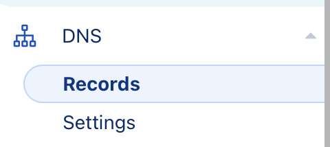
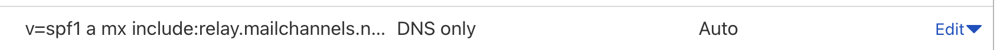
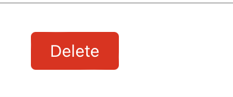

- Login to the Cloudflare account which conains the domain you are going to use with Shoutbox

- Click on the domain name to go to it's settings

- Click on DNS / Records in the left menu 

- Look for anything under the Content header

That looks like this; 

- For every entry that looks like that, click Edit behind the entry: 

- And click Delete

- Repeat for all similar entries

- Now return to the Shoutbox setup.