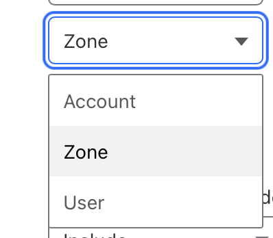
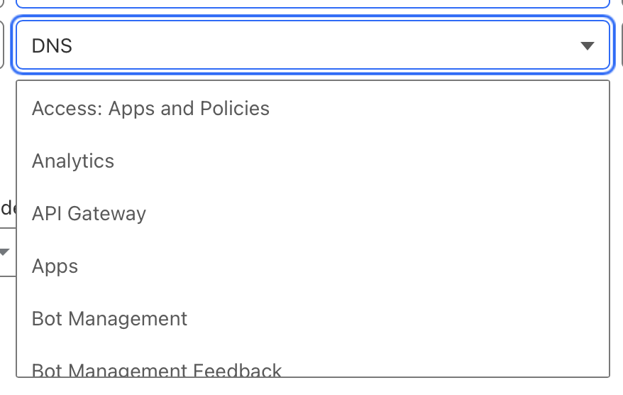

- Log in to your account on [Cloudflare](https://cloudflare.com)

- Click on any domain in your domain list

- Copy your Account Id to the Shoutbox entry

- Go to [My Profile](https://dash.cloudflare.com/profile) 

- Go to [API Tokens](https://dash.cloudflare.com/profile/api-tokens)

- Click on Create Token

- Pick the template "Edit Cloudflare Workers"

- Click on + Add more 

- Pick Zone from the first dropdown 

- Pick DNS from the middle dropdown

- Pick Edit from the last dropdown

- The end result should be

- Protect the Token for access to more account resources if there are any: 

- Protect the Token for access to more domains 

*Note*: Pick all domains or pick all that you intend to use with Shoutbox.

- Click on Create Token on the current and the next page to create the token 

- And add it in the Shoutbox form

Return to the Shoutbox setup. 