# Introduction 

Shoutbox is a simple to use API for developers. Using any language that allows call out to the Shoutbox API, a large volume of emails can be sent. 

Pick your environment below to start setting up and sending email: 

[CURL](./b3K6TMSsuooLnSQYOGVsRd)

[NodeJS](./BRcuD5CFnJ922YOKIATLHS)


# Prerequisites

- A [Cloudflare](https://cloudflare.com) account 
- One or more domains connected to that Cloudflare account

# New User: Set up domain 

- Go to: https://shoutbox.net
- Click on https://shoutbox.net/auth/sign-up

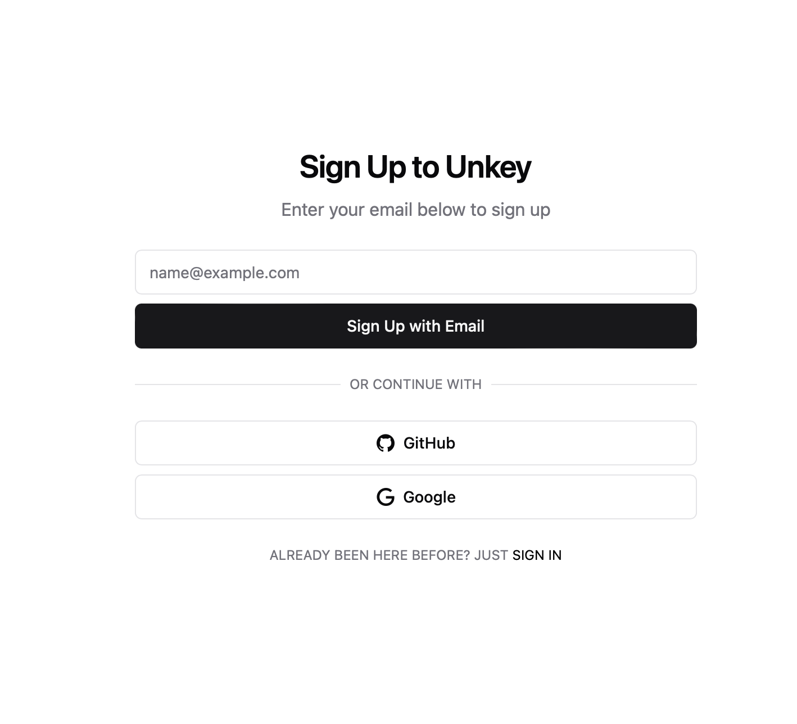

and Sign up with your information. 

- Create a team to work with

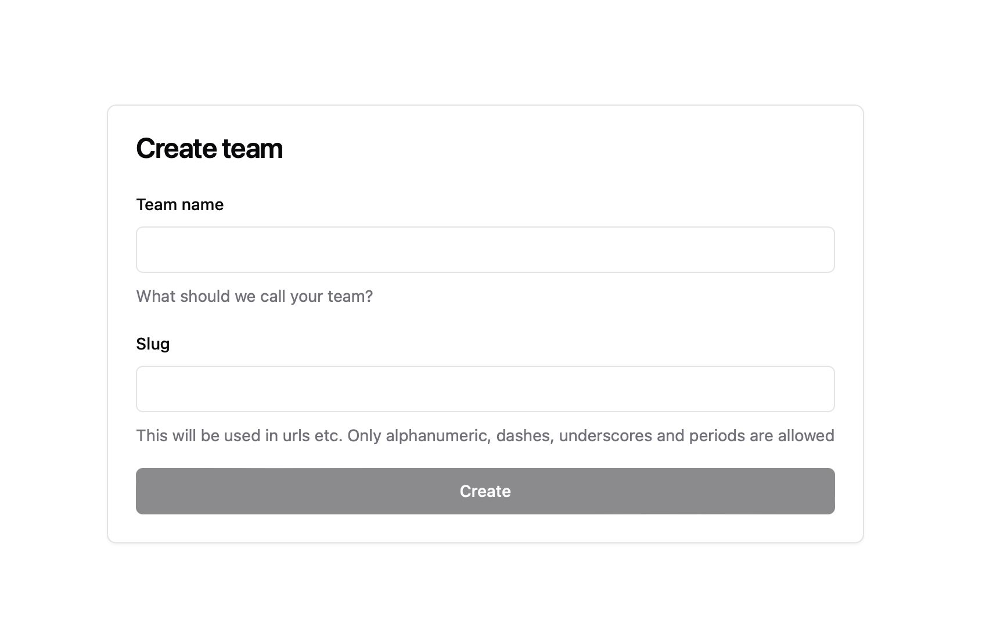

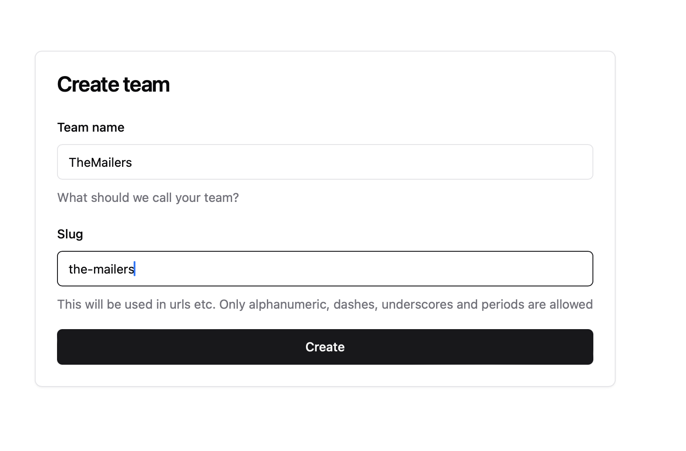

- Now gather the Cloudflare information for your account; 

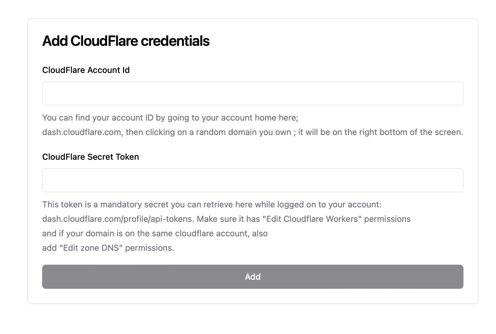

Please see the guide here how to complete this step: [Cloudflare retrieve your Account ID & Secret Token](./cloudflare-retrieve-account-id-and-secret.md)

- Click to add a Cloudflare Worker automatically

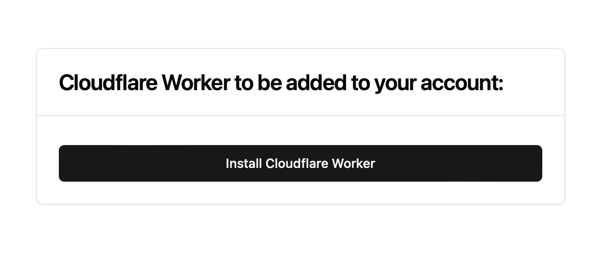

- Now it is time to add the first Domain

*Note*: this domain must be in your Cloudlfare account, in the account you picked when setting up the account Id and secret; this cannot work if this was not set up properly. 

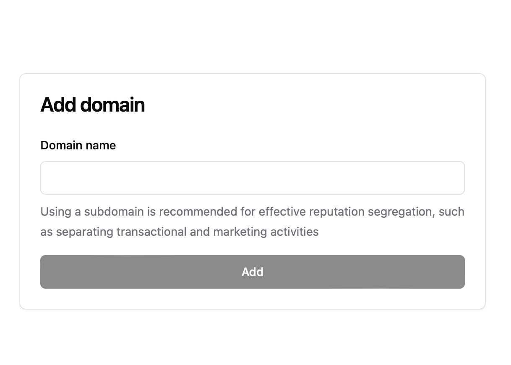

- Now you can automatically or manually set up your domain for use with Shoutbox

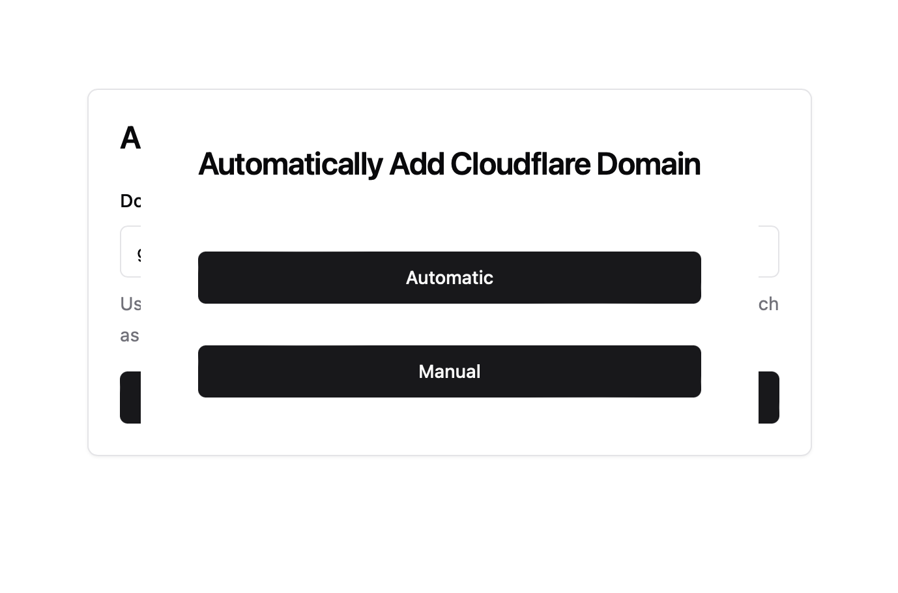

- To make sure everything goes more smoothly, it is recommend to clean up the Cloudflare DNS first, click here to see how; [Cleanup Cloudflare DNS](./cleanup-cloudflare-dns.md)

- Click to automatically add the information in Cloudflare


- Enter the domain, without www. in the box below to continue

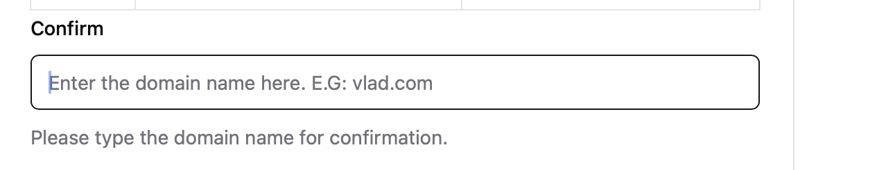

- Continue to add the records 

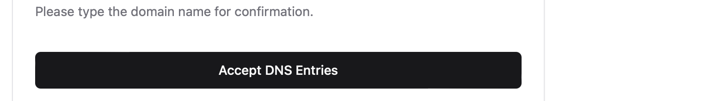

- On the keys screen, add a key for your account to send email with

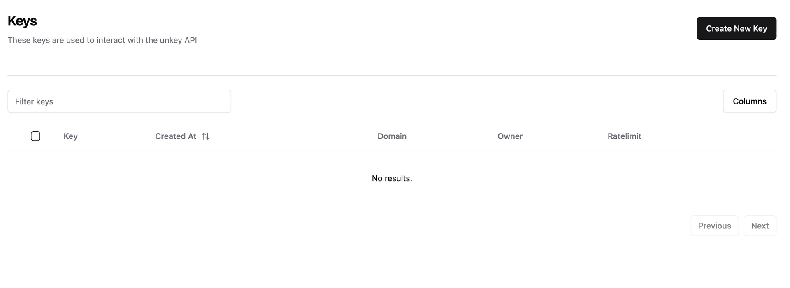

- Pick a name and a domain, or All domains

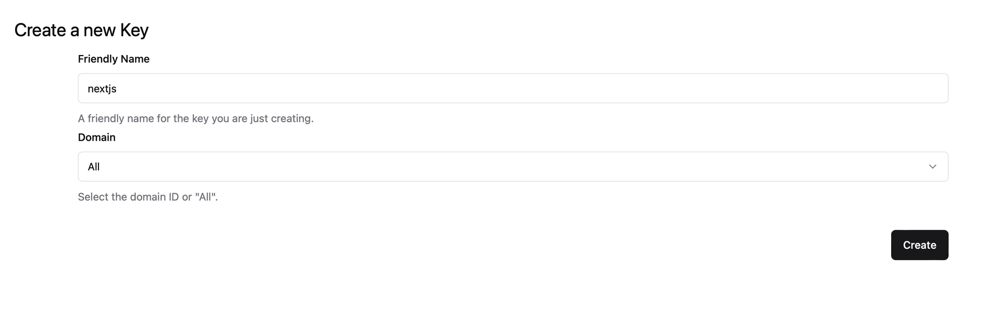

- Click Create

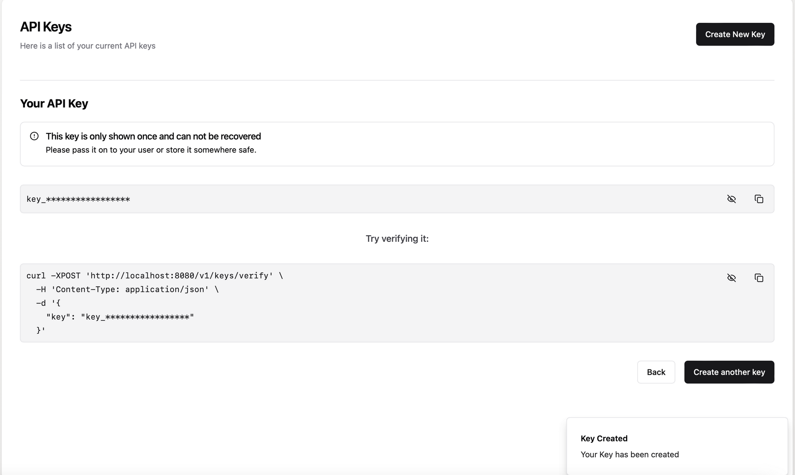

- Copy the Key starting with key_ somewhere safe! 

This key cannot be copied again after this step but is required to send emails. You can always go back to API Keys and then Create another key. 

- Verify the domain by clicking Domains in the left menu

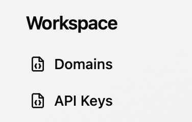

- Check for the domain that was Not Started yet and click on it

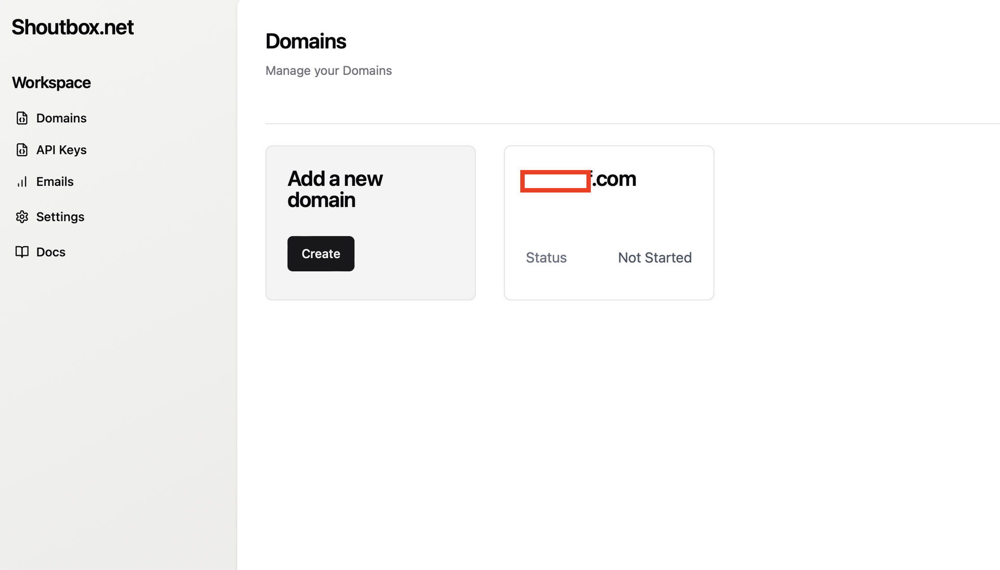


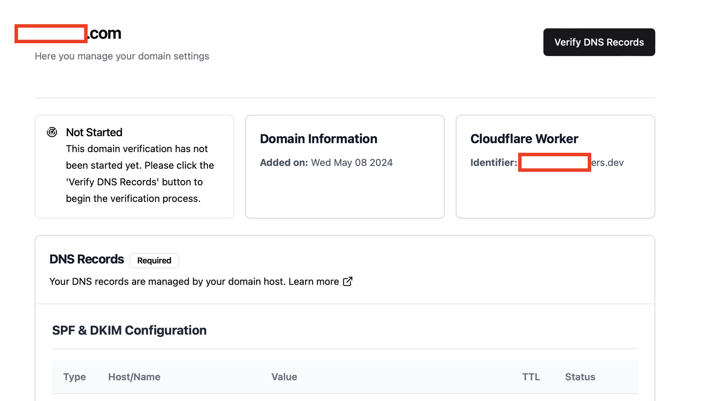


- Click on the Verify DNS Records button


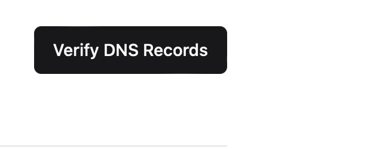


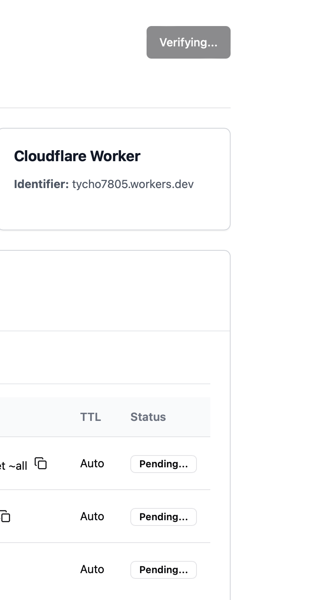


- This step can take 24 hours at max; when it has been completed, it shows active or an error

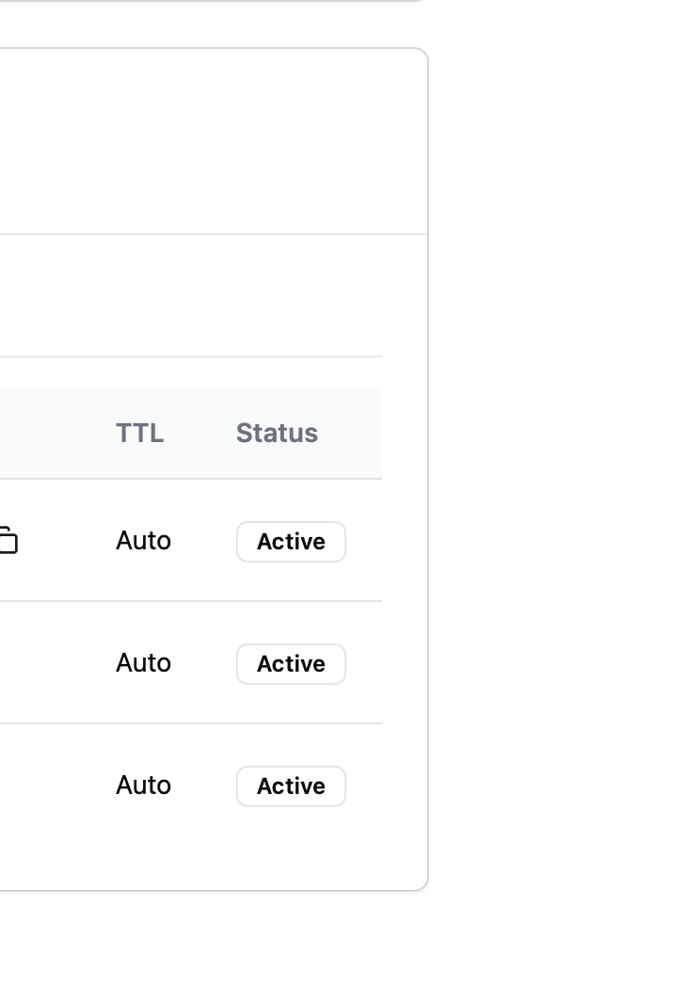

## Congratulations! 

You are ready to send your first email. Return to the settings for your preferred development language / environment or try to send a test email: 


```
curl -X POST 'https://api.shoutbox.net/send' \
  -H 'Authorization: Bearer key_XXXXXXXXXXXX' \
  -H 'Content-Type: application/json' \
  -d $'{
    "from": "no-reply@YOURDOMAIN.com",
	  "name": "Tycho", 
    "to": "someone@somewhere.com",
    "subject": "Hello World",
    "html": "<strong>it works!</strong>"
  }'

```

Replace key_XXXXXXXXXXXX with the key you saved from the Shoutbox API keys and change the From Address with your own email/domain and the To address with some address you want to try to send to. *Make sure to use the domain you used and activated above*. 

